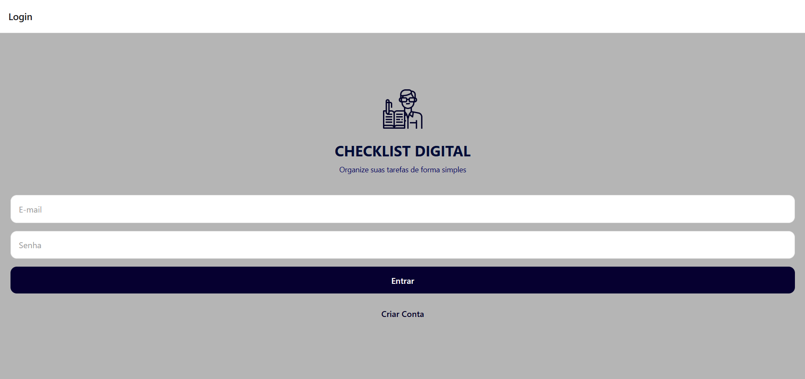
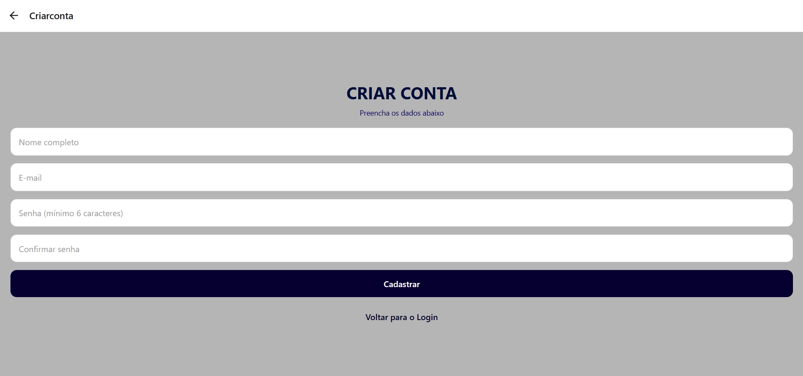
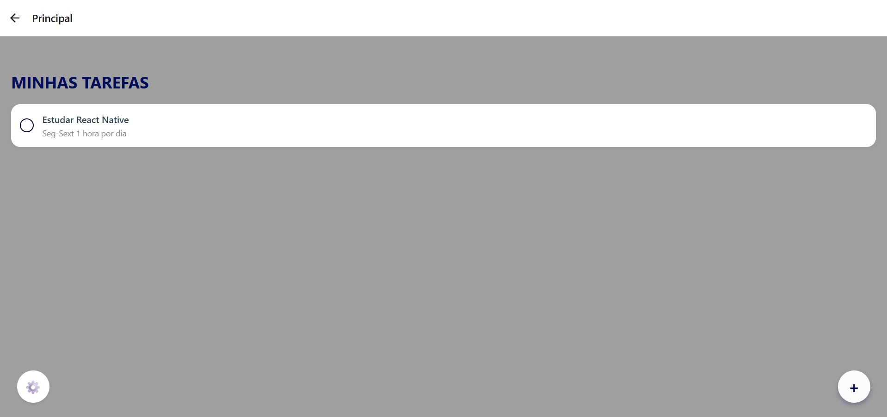
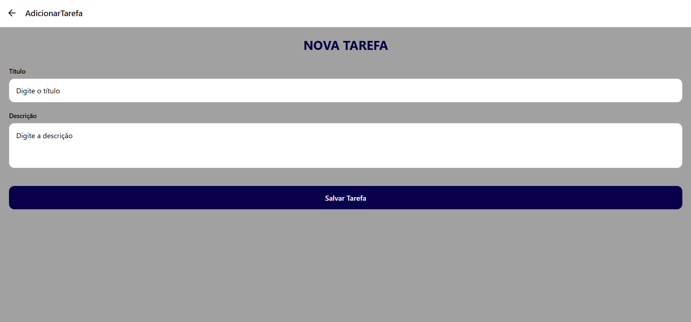
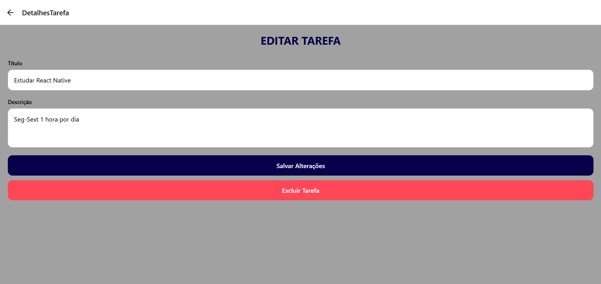
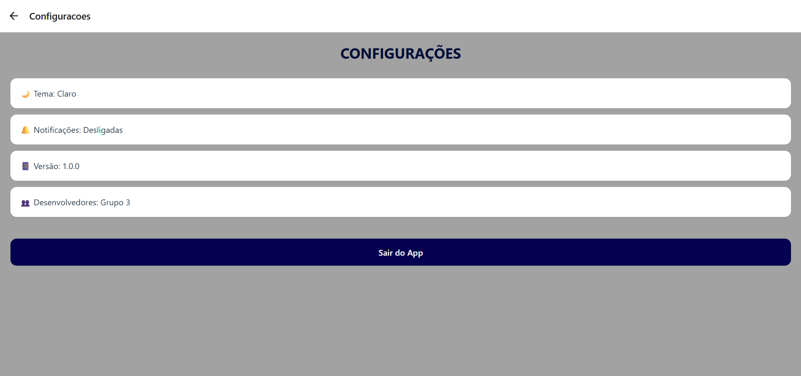

# ✅ Gerenciador de Tarefas

## 📱 Sobre o Projeto

**Gerenciador de Tarefas** é um aplicativo mobile desenvolvido em **React Native** com o objetivo de ajudar os usuários a organizarem suas atividades diárias de forma simples, rápida e intuitiva.

Com uma interface limpa e moderna, o app permite que você crie, edite, acompanhe e exclua tarefas, mantendo tudo sob controle no seu dia a dia.

> Projeto desenvolvido como trabalho final da disciplina **Desenvolvimento para Dispositivos Móveis** – 3º Período.

---

## 🎯 Funcionalidades

| Funcionalidade | Descrição |
|----------------|-----------|
| 🔐 **Login** | Acesso simulado à aplicação |
| 📝 **Criar Conta** | Cadastro com validação de campos e senha |
| ✅ **Lista de Tarefas** | Visualização de todas as tarefas cadastradas |
| ➕ **Adicionar Tarefa** | Criação de novas tarefas com título e descrição |
| ✏️ **Editar Tarefa** | Alteração do título e descrição de uma tarefa existente |
| 🗑️ **Excluir Tarefa** | Remoção de tarefas com alerta de confirmação |
| ✔️ **Concluir Tarefa** | Marcar/desmarcar tarefa como concluída (checkbox) |
| ⚙️ **Configurações** | Informações do app e opções simuladas de tema/notificações |

---

## 🖼️ Telas do Aplicativo

| Login | Criar Conta | Principal |
|-------|-------------|-----------|
|  |  |  |

| Adicionar Tarefa | Detalhes | Configurações |
|------------------|----------|---------------|
|  |  |  |

> *As imagens acima devem ser adicionadas na pasta `prints/` do repositório.*

---

## 🛠️ Tecnologias Utilizadas

- **React Native** – Framework para desenvolvimento mobile
- **Expo** – Ferramenta para facilitar o desenvolvimento
- **React Navigation** – Navegação entre telas (Stack Navigator)
- **Context API** – Gerenciamento de estado global das tarefas
- **JavaScript (ES6+)** – Linguagem de programação

---

## 📋 Requisitos Atendidos

| Requisito | Status |
|-----------|--------|
| ✅ View | Implementada |
| ✅ Text | Implementado |
| ✅ TextInput | Implementado |
| ✅ Button (TouchableOpacity) | Implementado |
| ✅ FlatList | Implementada |
| ✅ Image | Implementada |
| ✅ Layout com Flexbox | Implementado |
| ✅ Navegação entre telas | Implementada (6 telas) |
| ✅ Mínimo de 5 telas | Implementado (6 telas) |

---

## 🎨 Layout de Inspiração

O design visual do aplicativo foi inspirado no layout **"Todo List App Clean & Modern Free"** disponível na comunidade do Figma.

- **Link do layout:** [Todo List App - Clean & Modern](https://www.figma.com/community/file/1056617538023886207/todo-list-app-clean-modern-free)

---

## 🚀 Como Executar o Projeto

### Pré-requisitos

- Node.js instalado
- Expo CLI ou npm/yarn
- Expo Go (no celular) ou emulador

### Passos

1. **Clone o repositório**

git clone https://github.com/RAFAxs314/Gerenciador-de-Tarefas.git

## 👥 Desenvolvedores

| Nome | 
|------|
| **Rafael Expedito** | 
| **João Pedro** | 
| **Diego Magno** | 

---

## 📊 Status do Projeto

✅ **Concluído** – Todos os requisitos mínimos e funcionais foram implementados.

---

## 📄 Licença

Este projeto foi desenvolvido para fins acadêmicos. Não possui licença de uso comercial.

---

**⭐ Se gostou do projeto, deixe uma estrela no repositório!**
